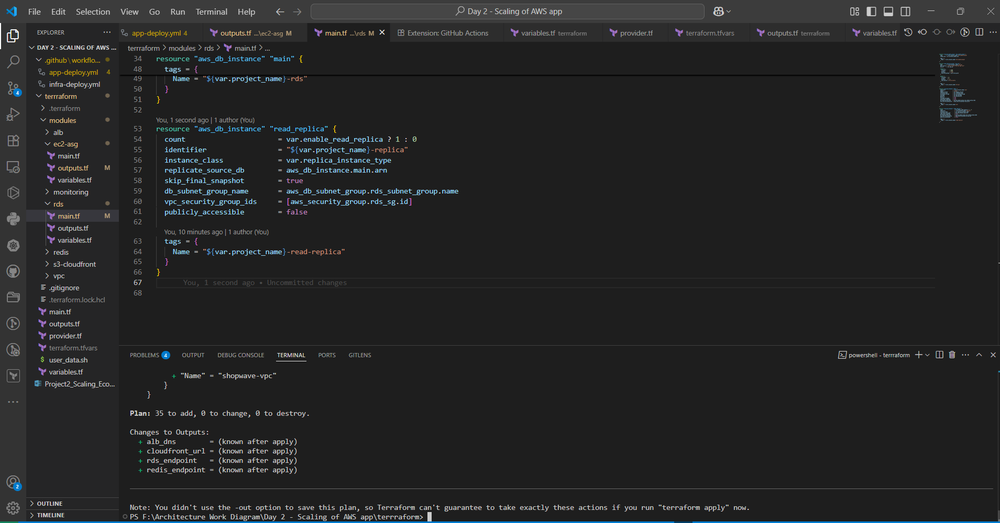
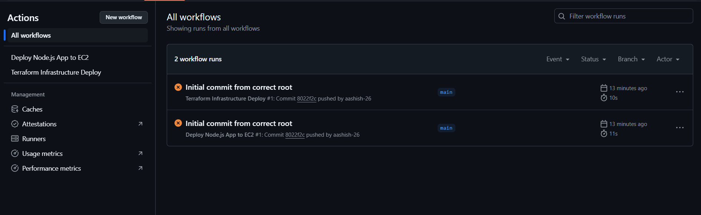

# Project 2: Scaling a Monolithic E-Commerce App on AWS

This project simulates a real-world e-commerce application that experiences performance issues during traffic spikes. I took the role of a Solution Architect and DevOps Engineer to design, provision, and automate a scalable and reliable AWS-based solution using Terraform and GitHub Actions.

---

## 📍 Problem Overview

**Client:** ShopWave (fictional)  
**Context:** Mid-sized e-commerce platform for fashion and electronics  
**Issue:** Application slows down or crashes during high-traffic events (Diwali, marketing campaigns)

### Pain Points
- Monolithic Node.js app hosted on a single EC2 instance
- Manual scaling and deployments
- No caching or CDN integration
- No monitoring or backup strategy

---

## 🎯 Objectives

- Redesign the infrastructure to handle seasonal traffic surges
- Improve availability and response time
- Introduce automated infrastructure provisioning and app deployment
- Keep the setup simple for a small DevOps team (2 engineers)

---

## 🔧 Solution Architecture

The application is hosted on AWS and modularized with Terraform. Key components include:

- **EC2 + Auto Scaling Group** — for running the app with dynamic scaling
- **Application Load Balancer** — for distributing traffic
- **RDS (MySQL) + Read Replica** — for database redundancy and performance
- **ElastiCache (Redis)** — for caching frequently accessed product data
- **S3 + CloudFront** — for fast and reliable delivery of static content
- **IAM + Secrets Manager** — for access control and secure credentials
- **CloudWatch + SNS** — for monitoring, logging, and alerts
- **VPC Flow Logs** — for network visibility

---

## 🧰 CI/CD Pipeline (GitHub Actions)

Two GitHub Actions workflows are used:

### 1. `infra-deploy.yml`
- Validates and formats Terraform files
- Runs `terraform plan` to preview changes
- Can optionally apply infrastructure (disabled by default)

### 2. `app-deploy.yml`
- Connects to EC2 via SSH
- Pulls latest app code from GitHub
- Installs dependencies and restarts the Node.js app using PM2

Both workflows can be triggered on `git push` or manually from the Actions tab.

---

## 🗂️ Project Structure

Project-2-Scaling-of-aws-app/
├── app/
│ └── index.js
├── terraform/
│ ├── main.tf
│ ├── variables.tf
│ ├── outputs.tf
│ ├── terraform.tfvars
│ ├── user_data.sh
│ └── modules/
│ ├── vpc/
│ ├── alb/
│ ├── ec2-asg/
│ ├── rds/
│ ├── redis/
│ ├── s3-cloudfront/
│ └── monitoring/
├── .github/
│ └── workflows/
│ ├── infra-deploy.yml
│ └── app-deploy.yml
├── .gitignore
└── README.md

## 🖼️ Screenshots

| Terraform CI Pipeline | App Deploy Workflow | Folder Tree |
|------------------------|---------------------|-------------|
| ✅ Plan Output          | ✅ SSH Deploy Logs   | ✅ Project Layout |

---

## 🧑‍💻 My Role

- Created a detailed solution architecture based on business requirements
- Converted the architecture into Terraform modules for reusability
- Built CI/CD workflows with GitHub Actions for both infrastructure and app
- Wrote documentation and simulated client scenarios with AI assistance

---

## 🛠️ Tools & Technologies

- AWS (EC2, ALB, RDS, CloudFront, S3, ElastiCache)
- Terraform (modularized infrastructure-as-code)
- GitHub Actions (CI/CD)
- PM2 (Node.js process manager)
- CloudWatch, SNS, IAM, VPC

---

## 📦 Deliverables

- ✅ Terraform infrastructure code (modular)
- ✅ CI/CD pipelines for infra and app
- ✅ Monitoring with CloudWatch & alarms
- ✅ Cost estimation and phased implementation
- ✅ LinkedIn-ready documentation and architecture diagram

 Note: This project includes a complete terraform plan and CI/CD setup, but terraform apply was intentionally skipped to avoid provisioning real AWS infrastructure during testing. The GitHub Actions workflow is fully functional up to the planning stage and demonstrates all required validations.